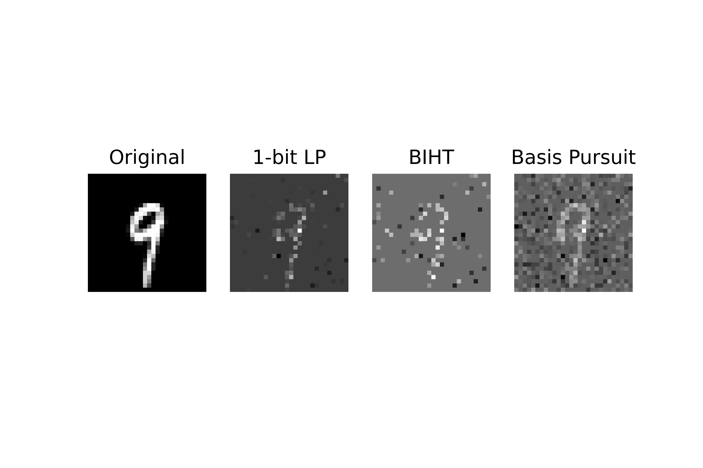

# "One-bit Compressed Sensing by Linear Programming" by Plan & Vershynin

## Reproduction authors

The reproduction is an independent effort by Théodor Lemerle & Théophile Cantelobre to illustrate Plan & Vershynin's paper with experimental results.

Feel free to reach out if you have any questions or comments: theophilec [at] gmail [dot] com.

## Summary of the approach

Plan & Vershinyn show that the One-bit Compressed Sensing problem can be solved as a linear program.

Theoretically, the approach has two main ingredients:

* notions of _tesselations_ (sections 3 and 4)
* notion of effective sparsity (section 5)

## Experiments 

### Synthetic sparse vectors

Inspired by the experiments in [6].

We generate sparse vectors, where the non-zero components are iid standard Normal. Then try to reconstruct the signals

We do the same experiments on the MNIST dataset (see `reproduction-mnist.ipynb`)

### Methods

We compare the following three methods (implemented in `algos.py`):

* (Thresholded) Basis Pursuit (by LP solver)
* Binary Iterative Hard Thresholding [18]
* 1-bit LP from Plan & Vershynin.

## Bibliography

[6]: Boufounos & Baraniuk. 1-bit compressive sensing. (2008)
[18]: Jacques et al. Tobust 1-bit compressive sensing via binary stable embeddings of sparse embeddings. (2011)
